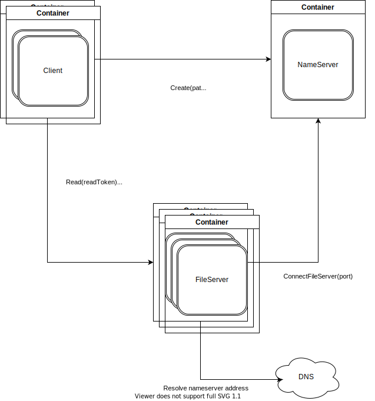

# Go-vno (GO virtual node orchestration) project

Is distributed file system project with fuse driver. It has the folowing
architecture:

## Architecture

Fuse file system talks to only one server -- Name server (NS shortly) which i
used for indexing and replicating files. It containes all directory hierarchy
and contains all ids of files in file servers (FS shortly).

Files are replecated on several nameservers with same ids. Fuse driver gets
ids and ips of FS to retrieve info from. FS are basically a key value storage
with files.

## Startup

At startup nameserver knows nothing about environment and waits connections
from fileservers.

FS try to establish connection with NS and after that they ping NS every
second. If NS doesn't recieve ping from it, NS thinks that FS is down and
replicates all files which were there to other servers.

## Technologies

As for technologies we use fuse for interacting with kernel for using
filesystem. `grpc` and `protobuf` used in order to define communication
between fuse driver and NS, NS and FS and vice versa. For FS file names we
use `uuid`.

## Project layout

- Protobuf files are in [api/](./api) folder.
- [cmd/](./cmd) folder is used for all cli tools in project.
- [pkg/](./pkg) is for go libraries we use in [cmd/](./cmd)
- [pkg/api/](./pkgapi/) is for protobuf generated files
- [docker/](./docker) is for dockerfiles and docker-compose

## Local run

In order to start everything run

    $ make -j3 local_run
	
you will end up in container where you should run

    # ./client nameserver:3000 ./mnt/
	
after that you may go to `/mnt/` directory and use filesystem as every other
filesystem you used to know.

